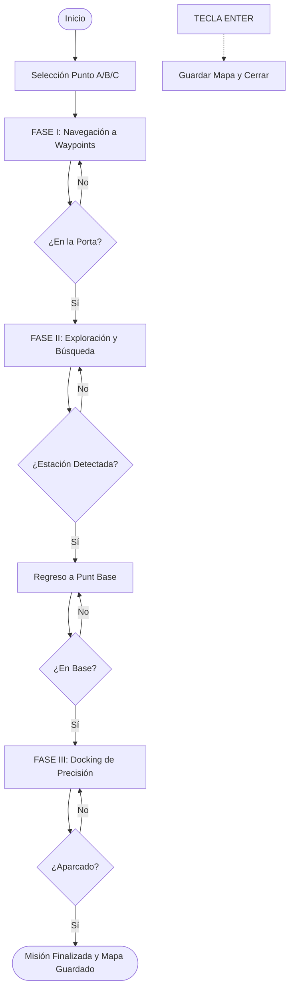

# Documentación Técnica del Sistema de Navegación Autónoma

Este documento describe la arquitectura, lógica y flujo de datos del paquete `autonomous_nav_pkg`.

## 1. Arquitectura del Sistema

El sistema utiliza una arquitectura modular dividida en tres componentes principales:

```mermaid
graph TD
    A[MissionController] --> B[Navigator]
    A --> C[Perception]
    Sub_Lidar[/scan] --> A
    Sub_Odom[/odom] --> A
    A --> Pub_Cmd[/cmd_vel]
    
    style A fill:#f9f,stroke:#333,stroke-width:2px
```

*   **MissionController**: El nodo central que gestiona la máquina de estados y las transiciones entre fases.
*   **Navigator**: Módulo especializado en el cálculo de vectores de fuerza (APF) para el movimiento.
*   **Perception**: Módulo de visión por LiDAR que segmenta obstáculos e identifica la estación de carga.

---

## 2. Diagrama de Flujo (Flowchart)

El siguiente diagrama describe el ciclo de vida de la misión desde el arranque hasta el aparcamiento final:



---

## 3. Desglose de Funciones Principales

### Clase `MissionController`
*   **`timer_callback()`**: El bucle principal (20Hz). Actualiza la pose y decide qué fase ejecutar.
*   **`execute_phase_X()`**: Cada fase gestiona sus propios objetivos y criterios de éxito.
*   **`_emergency_listener()`**: Hilo paralelo que vigila la terminal. Permite cerrar el sistema de forma segura sin perder los datos del mapa.
*   **`save_map()`**: Lanza un subproceso de `map_saver_cli` para persistir el mapa generado por SLAM.

### Clase `Navigator`
*   **`compute_apf_cmd_vel()`**: Implementa el algoritmo de Campos Potenciales.
    *   Calcula el vector de atracción al objetivo.
    *   Calcula el sumatorio de vectores de repulsión del LiDAR.
    *   Funde ambos vectores para obtener la dirección óptima.
*   **`_update_avoid_hysteresis()`**: Filtro temporal para evitar que el robot "vibre" ante ruido en el sensor o pequeños obstáculos.

### Clase `Perception`
*   **`cluster_points()`**: Convierte lecturas de distancia en grupos de objetos en el espacio 2D.
*   **`find_charging_station()`**: Aplica combinatoria sobre los clusters. Si cuatro clusters pequeños forman un cuadrado de dimensiones predefinidas, confirma la posición de la base.
*   **`detect_obstacles()`**: Registra la posición de cajas y columnas para el log de misión.

---

## 4. Flujo de Datos y Vínculos

1.  **Entrada**: El nodo recibe `LaserScan` y `Odometry`.
2.  **Procesamiento**:
    *   `Perception` procesa el scan para actualizar la posición de obstáculos.
    *   `Navigator` procesa el scan para calcular fuerzas de repulsión.
    *   `MissionController` usa la posición para seleccionar el waypoint activo.
3.  **Salida**: Se publica un mensaje `Twist` en `/cmd_vel` con las velocidades calculadas para mover los motores.
