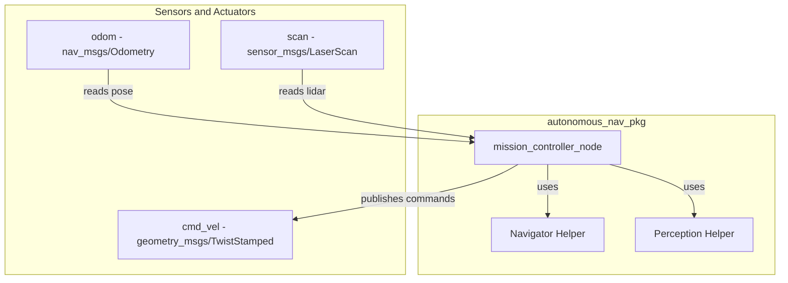

# Autonomous Navigation Project - Technical Report

## System Architecture Diagram

## Algorithm Description

### Phase I: Global Navigation & Obstacle Avoidance
The robot operates based on a state machine governed by `mission_controller_node`. For Phase I, it relies on the `Navigator` helper class, which implements a proportional point-to-point controller. The system uses `/odom` to continuously measure distance and angle errors relative to predetermined waypoints (B, O, and P Base). It issues angular velocity proportional to the heading error and linear velocity proportional to the distance. Navigation to the next waypoint is triggered when the robot falls within a `0.15m` tolerance zone of the target.

### Phase II: Perception & Area Exploration
Once at P Base, the robot enters an exploration sweep pattern around the "Passadis" zone. The `Perception` class processes `/scan` data to convert polar coordinates into Cartesian space. It uses a distance-based clustering algorithm to group adjacent points (15cm threshold). The algorithm filters out large features (walls) to isolate 5cm pillar candidates. It then analyzes all combinations of four points to find a set that forms a 40x40cm square by checking pairwise Euclidean distances. When the station is found, its center coordinate is calculated, logged, and set as the docking target for Phase III.

## Obstacle Avoidance Strategy
To prevent collisions, a reactive obstacle avoidance layer actively overrides the predefined path. The `Perception` class checks for points within a 60-degree forward cone (-30 to +30 degrees). If any point falls below the conservative `0.35m` clearance threshold, the system immediately suspends standard navigation. The robot assumes a purely angular velocity to rotate away until the forward cone is entirely clear of obstacles. It then moves forward momentarily before re-calculating its trajectory to the goal, acting similarly to a 'Bug' algorithm's boundary-following behavior.
